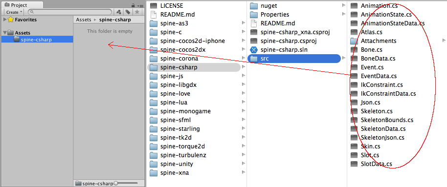
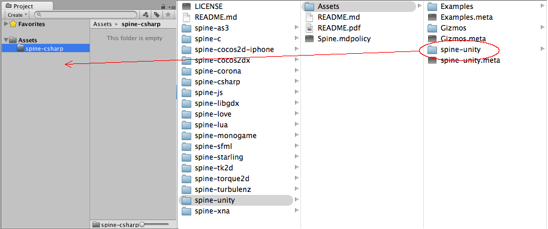
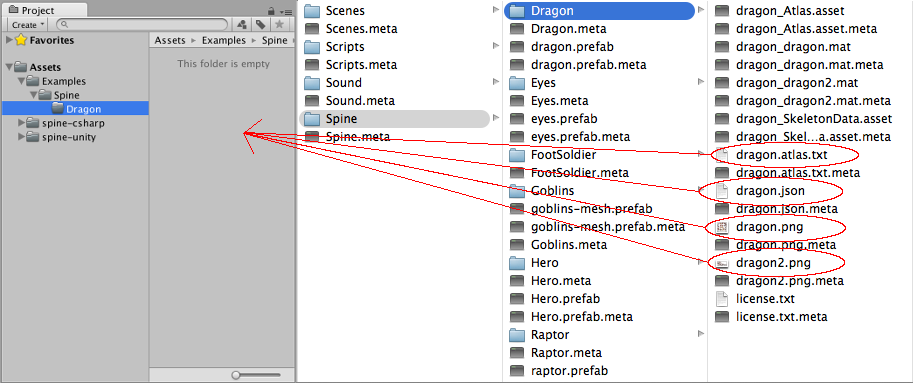
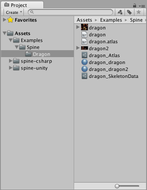
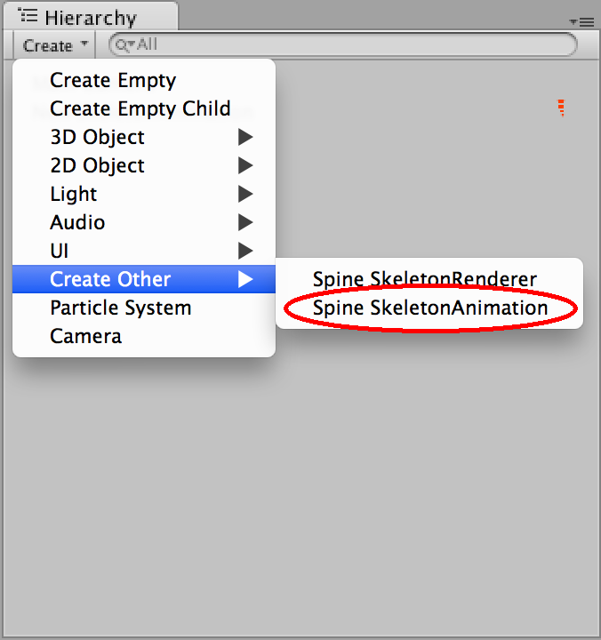
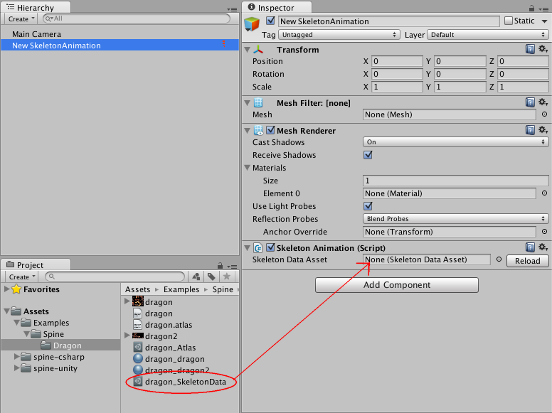
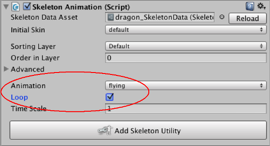
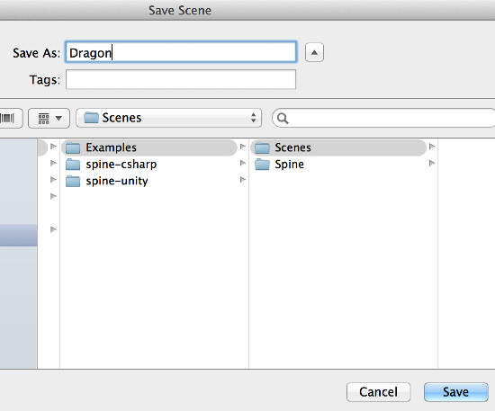
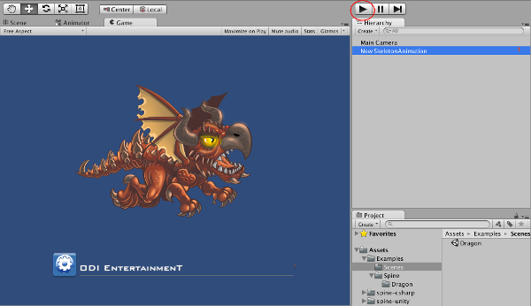

#UnityでSpineアニメーションを動かしちゃおう！

##Spineアニメーション初期設定

###UnityでSpineアニメーションを動かすための準備
UnityでSpineを使う際にはランタイムが必要なので、下記のアドレスからZipファイルをダウンロードする。

https://github.com/EsotericSoftware/spine-runtimes

###Spineランタイムの設定
「spine-runtimes-master」内にある「spine-csharp」と「spine-unity」がSpineを使うのに必要なランタイムです。

「Assets」に「spine-csharp」のフォルダを作成し、
「spine-csharp/src」の中身を「Assets/spine-csharp」にD&Dする。

「spine-unity/Assets/spine-unity」のフォルダを「Assets」にD&Dする。

###Spine表示までの設定
「Assets」に「Examples/Spine/Dragon」のフォルダを作成し、
「spine-unity/Assets/Examples/Spine/Dragon」のフォルダにある
「dragon.atlas.txt」「dragon.json」「dragon.png」「dragon2.png」のファイルを
「Assets/Examples/Spine/Dragon」にD&Dする。

D&Dが完了すると、「dragon_Atlas」「dragon_dragon」「dragon_dragon2「dragon_SkeletonData」の４つが作成される。

###Hierarchy内にSpineSkeletonAnimationを作成
Hierarchy内の「Create」「Create Other」「Spine SkeletonAnimation」を選択する。

「Skeleton Animation」の「Skeleton Data Asset」に「dragon_SkeletonData」をD&Dする。

「Animation」を「flying」に設定する。
「Loop」にチェックを入れるとアニメーションがループ再生される。

最後にSceneのセーブ場所として、「Examples/Scenes」に「Dragon」のファイル名でセーブする。

Unityの実行ボタンを押すと、アニメーションが再生されます。

以上が簡単なSpineアニメーションの設定です。

